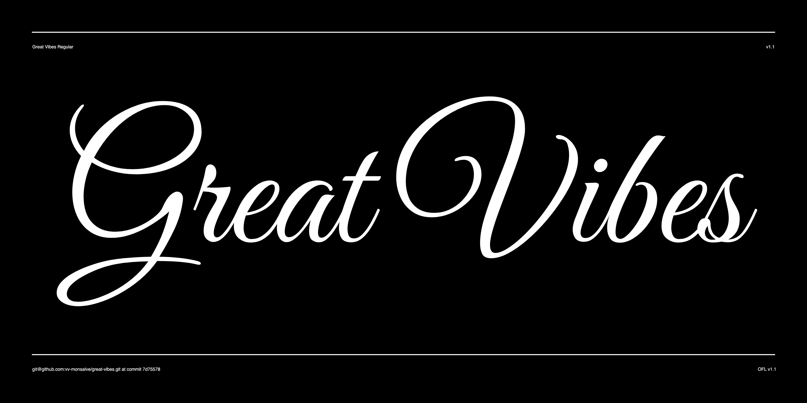
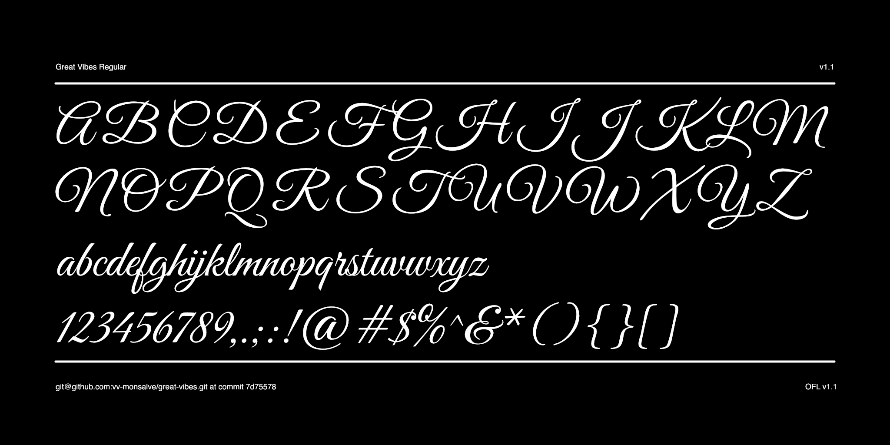

# Great Vibes

Great Vibes is a beautifully flowing script with casual uppercase forms combined with more formal lowercase letters.  

It has over 2000 glyphs, with smooth connecting ligatures and alternate characters.

In March 2024, Great Vibes was updated to provide extended language support, including Sub-Saharan Latin and Cyrillic.

## Building the font

Fonts are built automatically by GitHub Actions - take a look in the "Actions" tab for the latest build.

If you want to build fonts manually on your own computer:

* `make build` will produce font files.
* `make test` will run [FontBakery](https://github.com/googlefonts/fontbakery)'s quality assurance tests.
* `make proof` will generate HTML proof files.

## Changelog

**March 2024. Version 1.100**
- SIGNIFICANT Latin SSA and Cyrillic support added.